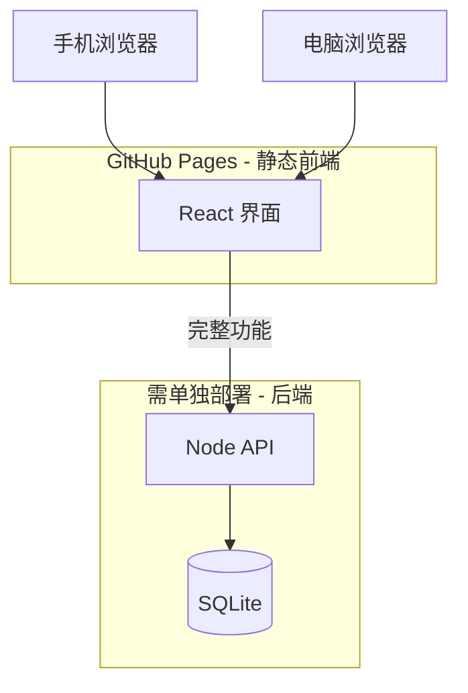

# 部署指南

## GitHub Pages 访问地址

合并到 `main` 分支并部署成功后，可通过以下地址访问（**电脑与手机浏览器均支持**）：

**https://dexy1024.github.io/api_res_time_stat/**

> 若仓库名或用户名变更，地址格式为：`https://<用户名>.github.io/<仓库名>/`

---

## 架构说明：Web 与移动端是否共用一套？

**是的，理论上一套代码同时适配 Web 与移动端。**

| 端 | 实现方式 |
|----|----------|
| 桌面 Web | 左侧边栏 + 主内容区 |
| 手机 / 平板 | 顶部栏 + 底部 Tab 导航 + 抽屉菜单 |
| 技术 | 同一 React 应用 + Ant Design 响应式 + Tailwind |

无需单独开发两套前端；通过响应式布局，同一 URL 在手机和电脑上均可正常使用。

---

## 部署分层



| 组件 | 部署位置 | 说明 |
|------|----------|------|
| 前端 | GitHub Pages | 界面演示、本地 Zustand 缓存 |
| 后端 | 云服务器 / Railway 等 | API Key、视频生成、文件上传 |

GitHub Pages **仅托管静态文件**，无法运行 Node 后端。因此：

- ✅ 页面浏览、导航、本地偏好设置 — 可用
- ⚠️ 上传素材、创建视频任务 — 需配置 `VITE_API_BASE_URL` 指向你的后端

---

## 首次启用 GitHub Pages

1. 打开仓库：https://github.com/dexy1024/api_res_time_stat
2. 进入 **Settings → Pages**
3. **Source** 选择 **GitHub Actions**
4. 将包含新 workflow 的分支合并到 `main`
5. 在 **Actions** 标签页查看部署进度
6. 部署完成后访问：https://dexy1024.github.io/api_res_time_stat/

---

## 本地开发

```bash
# 后端（完整功能）
cd server && npm install && cp .env.example .env && npm run dev

# 前端
cd apps/web && npm install && npm run dev
```

本地访问：http://localhost:5173

---

## 生产环境连接后端

构建前端时指定后端地址：

```bash
VITE_API_BASE_URL=https://your-api.example.com/api npm run build --prefix apps/web
```

或在 GitHub Actions 的 build 步骤中加入该环境变量。

---

## 手机访问方式

1. 用手机浏览器打开 GitHub Pages 地址
2. iOS Safari：可「添加到主屏幕」，像 App 一样打开
3. 页面已适配安全区域（刘海屏底部 Tab 不遮挡）

---

## v1 旧版页面

根目录 `index.html`（API 耗时统计 v1）在 v2 部署后不再作为 GitHub Pages 入口；如需保留，可单独分支或子路径部署。
