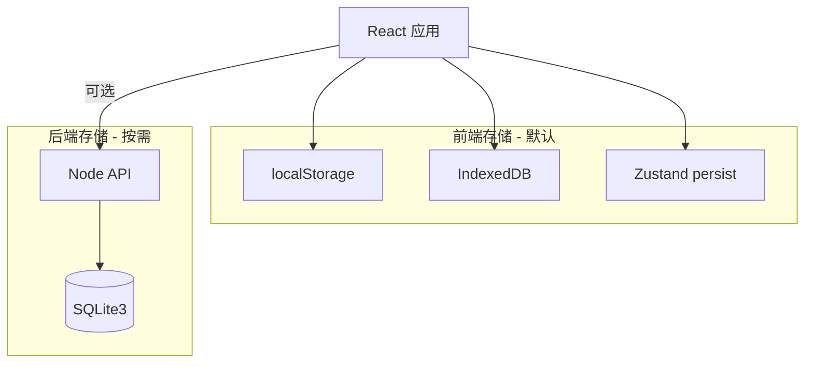

# API 耗时统计工具 — 产品与技术需求

> 版本：v2.0 规划  
> 状态：需求对齐中（待设计稿、技术账号）

---

## 1. 业务目标

| 维度 | 说明 |
|------|------|
| **核心问题** | 运维/开发需要快速分析 API 调用耗时分布，定位慢接口与异常区间 |
| **目标用户** | 后端开发、测试、运维、性能分析人员 |
| **成功标准** | 上传数据 → 一键分析 → 可视化结论清晰；移动端可查看与分享；数据可本地持久化 |

### 与现有 Web 版关系

- 现有 `index.html` + 原生 JS 版本为 **v1 静态站点**，保留作参考与迁移对照
- **v2** 采用 React 技术栈重构，功能对齐并扩展移动端与本地/持久化存储能力

---

## 2. 技术栈（硬性约束）

| 层级 | 选型 | 用途 |
|------|------|------|
| 框架 | **React 18+** | UI 与组件化 |
| 路由 | **TanStack Router** | 类型安全路由、代码分割 |
| 数据请求 | **TanStack Query** | 异步数据、缓存、重试、后台刷新 |
| 表格 | **TanStack Table** | 接口详情、分布统计等复杂表格 |
| 样式 | **Tailwind CSS** | 原子化样式、响应式布局 |
| Hooks | **ahooks** | 通用能力（防抖、本地存储、请求封装等） |
| 跨组件状态 | **Zustand** | 全局 UI 状态、分析会话、偏好设置 |
| UI 组件库 | **shadcn/ui**（见 §3） | 与 Tailwind 一致的设计系统 |
| 图表 | **Chart.js** 或 **Recharts** | 耗时分布可视化（待设计稿确认） |
| 文件解析 | **SheetJS (xlsx)** | Excel / CSV 解析（沿用 v1 能力） |

### 后端存储（按需启用）

| 层级 | 选型 | 用途 |
|------|------|------|
| 运行时 | **Node.js** | 本地/轻量服务端 |
| 数据库 | **SQLite3** | 持久化分析历史、大文件元数据（前端存储不足时） |

---

## 3. UI 组件库选型

**选定：shadcn/ui（Radix UI + Tailwind）**

| 考量 | 说明 |
|------|------|
| 与 Tailwind 一致 | 无样式冲突，定制成本低 |
| 表格场景 | 配合 TanStack Table 实现排序、分页、虚拟滚动 |
| 移动端 | 组件可响应式适配，便于后续 H5 / 移动 Web |
| 流行度 | 社区活跃，文档完善 |

**备选**：Ant Design 5 — 若后续以「中后台密集表单」为主且无强 Tailwind 统一要求时可切换评估。

---

## 4. 数据存储动作设计

> 原则：**优先前端存储**；仅当数据量大、需跨设备同步或审计追溯时，启用 SQLite3 后端。

### 4.1 存储分层



### 4.2 前端存储动作（P0）

| 动作 ID | 动作名称 | 存储介质 | 数据内容 | 触发时机 |
|---------|----------|----------|----------|----------|
| `ST-01` | 保存用户偏好 | localStorage + Zustand persist | 主题、默认排序列、图表动画开关 | 用户修改设置时 |
| `ST-02` | 缓存最近上传文件元信息 | localStorage | 文件名、大小、上传时间、记录条数（不含全量原始数据） | 文件解析成功后 |
| `ST-03` | 缓存分析结果 | IndexedDB | 按 `fileHash` 存 processedData、图表配置、摘要统计 | 分析完成时 |
| `ST-04` | 读取分析缓存 | IndexedDB | 命中则跳过重复计算 | 同文件再次分析前 |
| `ST-05` | 自定义接口中文名 | localStorage + Zustand | 扩展/覆盖内置 `apiChineseNames` 映射 | 用户编辑映射时 |
| `ST-06` | 清除本地数据 | localStorage + IndexedDB | 一键清空缓存与偏好（可保留偏好选项） | 用户点击「清除数据」 |
| `ST-07` | 导出分析快照 | 浏览器下载 | JSON / CSV 导出当前会话 | 用户点击「导出」 |

#### Zustand Store 划分

| Store | 职责 | persist |
|-------|------|---------|
| `useAppStore` | 当前文件、分析状态、错误信息 | 部分（会话 ID 不持久化） |
| `usePreferenceStore` | 主题、表格列显隐、默认排序 | 是 |
| `useApiNameStore` | 接口中文名自定义映射 | 是 |

#### ahooks 使用建议

| Hook | 场景 |
|------|------|
| `useLocalStorageState` | 轻量偏好项 |
| `useDebounceFn` | 表格搜索、筛选 |
| `useRequest` | 封装 TanStack Query 之外的简单异步 |
| `useMount` / `useUnmount` | 初始化 IndexedDB、清理 Chart 实例 |

### 4.3 后端存储动作（P1 — 按需启用）

**启用条件（满足任一）**：

- 单次上传记录数 > 10 万条，IndexedDB 写入/查询性能不足
- 需要多会话历史列表与检索
- 需要团队共享分析记录（后续扩展）

| 动作 ID | 动作名称 | API 语义 | SQLite 表 | 说明 |
|---------|----------|----------|-----------|------|
| `ST-B01` | 创建分析会话 | `POST /sessions` | `analysis_sessions` | 新建一次分析任务 |
| `ST-B02` | 写入原始记录 | `POST /sessions/:id/records` | `api_records` | 批量插入解析后的接口耗时 |
| `ST-B03` | 写入聚合统计 | `PUT /sessions/:id/stats` | `distribution_stats`, `api_summary` | 区间分布、接口汇总 |
| `ST-B04` | 查询会话列表 | `GET /sessions` | `analysis_sessions` | 分页、按时间排序 |
| `ST-B05` | 加载会话详情 | `GET /sessions/:id` | 联表查询 | 恢复完整分析视图 |
| `ST-B06` | 删除会话 | `DELETE /sessions/:id` | 级联删除 | 清理关联记录 |
| `ST-B07` | 文件元信息登记 | `POST /files` | `upload_files` | 仅存 hash、名、大小，不存二进制 |

#### SQLite3 表结构（草案）

```sql
-- 上传文件元信息
CREATE TABLE upload_files (
  id INTEGER PRIMARY KEY AUTOINCREMENT,
  file_hash TEXT NOT NULL UNIQUE,
  file_name TEXT NOT NULL,
  file_size INTEGER,
  record_count INTEGER,
  created_at TEXT DEFAULT (datetime('now'))
);

-- 分析会话
CREATE TABLE analysis_sessions (
  id INTEGER PRIMARY KEY AUTOINCREMENT,
  file_id INTEGER REFERENCES upload_files(id),
  status TEXT DEFAULT 'completed',  -- pending | completed | failed
  total_calls INTEGER,
  avg_time REAL,
  max_time REAL,
  min_time REAL,
  created_at TEXT DEFAULT (datetime('now'))
);

-- 原始 API 记录（大表，按需分页读）
CREATE TABLE api_records (
  id INTEGER PRIMARY KEY AUTOINCREMENT,
  session_id INTEGER NOT NULL REFERENCES analysis_sessions(id),
  api_name TEXT NOT NULL,
  duration_ms REAL NOT NULL
);

-- 耗时区间分布
CREATE TABLE distribution_stats (
  id INTEGER PRIMARY KEY AUTOINCREMENT,
  session_id INTEGER NOT NULL REFERENCES analysis_sessions(id),
  range_label TEXT NOT NULL,
  count INTEGER NOT NULL,
  percentage REAL
);

-- 接口维度汇总
CREATE TABLE api_summary (
  id INTEGER PRIMARY KEY AUTOINCREMENT,
  session_id INTEGER NOT NULL REFERENCES analysis_sessions(id),
  api_name TEXT NOT NULL,
  api_name_cn TEXT,
  call_count INTEGER,
  avg_time REAL,
  max_time REAL,
  min_time REAL
);
```

### 4.4 TanStack Query 与存储的协作

| Query Key | 数据来源 | staleTime | 说明 |
|-----------|----------|-----------|------|
| `['analysis', fileHash]` | IndexedDB / API | 24h | 分析结果缓存 |
| `['sessions']` | SQLite API | 5min | 历史会话列表（后端模式） |
| `['session', id]` | SQLite API | 10min | 单会话详情 |

---

## 5. 功能需求与优先级

### P0 — 首版必做（Web 重构）

| ID | 功能 | 说明 |
|----|------|------|
| F-01 | 文件上传 | 拖拽 / 点击，支持 xlsx、xls、csv |
| F-02 | 数据解析 | 对齐 v1 格式与区间分组规则 |
| F-03 | 统计摘要 | 总次数、平均/最大/最小耗时 |
| F-04 | 饼图分布 | 8 区间配色与 v1 一致 |
| F-05 | 接口详情表 | 排序、中文名、数量列 |
| F-06 | 分布统计表 | 区间数量与占比 |
| F-07 | 行列转换表 | 含下载 |
| F-08 | 5000ms+ 慢接口表 | 页面底部展示 |
| F-09 | 前端存储 | ST-01 ~ ST-07 全部实现 |
| F-10 | 响应式布局 | 平板与手机浏览器可用 |

### P1 — 第二阶段

| ID | 功能 | 说明 |
|----|------|------|
| F-11 | SQLite 后端 | ST-B01 ~ ST-B07 |
| F-12 | 历史会话 | 从服务端加载过往分析 |
| F-13 | 移动端优化 | 独立路由或 PWA |

### P2 — 后续

| ID | 功能 | 说明 |
|----|------|------|
| F-14 | 演示视频 | 产品操作录屏 + 旁白/字幕 |
| F-15 | 多用户 / 权限 | 视业务账号方案而定 |

---

## 6. 非功能需求

| 类型 | 要求 |
|------|------|
| 性能 | 1 万条以内分析 < 3s（前端） |
| 兼容 | Chrome / Safari / Edge 最新两个大版本 |
| 离线 | PWA 可选；至少本地缓存可离线查看上次结果 |
| 安全 | 默认不上传原始文件到服务端；SQLite 仅本地部署 |

---

## 7. 待补充项（由你后续提供）

| 项 | 状态 | 说明 |
|----|------|------|
| UI 设计稿 / 框架 | 待提供 | 页面结构、配色、组件布局 |
| 技术账号 | 待提供 | 部署、第三方服务、应用商店等 |
| MADJS 含义确认 | 待确认 | 是否指特定工具或「JS 搭页面骨架」 |
| 移动端形态 | 待确认 | H5 / PWA / 原生壳 / 小程序 |
| 视频规格 | 待确认 | 演示 / 教程 / 宣传；时长与语言 |

---

## 8. 建议目录结构（v2）

```
apps/
  web/                 # React + TanStack + Tailwind 主应用
    src/
      stores/          # Zustand
      hooks/           # ahooks + 业务 hooks
      services/        # 存储动作 ST-* 实现
      features/        # upload / analysis / charts / tables
packages/
  shared/              # 类型、常量、解析逻辑（从 v1 迁移）
server/                # 可选 Node + SQLite3
  db/
    schema.sql
docs/
  REQUIREMENTS.md      # 本文档
```

---

## 9. 需求评审备忘（Dev / QA / 业务）

| 视角 | 风险 / 关注点 |
|------|----------------|
| **开发** | v1 解析逻辑迁移需单测对照；IndexedDB 大文件注意分片写入 |
| **测试** | 边界：空文件、错误格式、超大 CSV、缓存过期、清除数据后状态 |
| **业务** | 区间分组规则变更需版本号与用户提示；中文名映射谁维护 |

---

## 10. 变更记录

| 日期 | 版本 | 说明 |
|------|------|------|
| 2026-07-01 | v2.0-draft | 初稿：技术栈、存储动作、功能优先级 |
