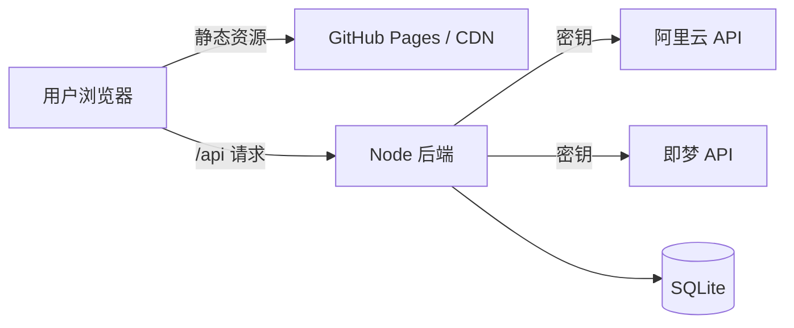

# AI 视频生成工作台 — 产品与技术需求

> 版本：v2.1  
> 状态：框架已搭建，待设计稿与 API Key

---

## 1. 业务目标（核心需求）

| 维度 | 说明 |
|------|------|
| **核心场景** | 用户提供图片、文档 → 在后台界面配置并生成视频 |
| **后台能力** | 管理素材、创建视频任务、查看历史、配置 AI 服务商 |
| **AI 服务商** | **阿里云（通义万相）**、**字节跳动（即梦 AI）** — API Key 由用户后续提供 |
| **交付形态** | Web 后台界面（优先）；移动端后续扩展 |
| **成功标准** | 素材可上传、任务可创建、多服务商可切换、视频结果可回看 |

### 与 v1（API 耗时统计）关系

- 根目录 `index.html` 等 **v1 静态页面保留**，不影响新应用
- **v2 新应用**位于 `apps/web/` + `server/`

---

## 2. 技术栈

| 层级 | 选型 |
|------|------|
| 框架 | React 19 + TypeScript + Vite |
| 路由 | TanStack Router |
| 数据请求 | TanStack Query |
| 表格 | TanStack Table（任务列表扩展时使用） |
| 样式 | Tailwind CSS + **Ant Design 6** |
| Hooks | ahooks |
| 跨组件状态 | **Zustand（3 个 Store，见 §4）** |
| 后端 | Node.js + Express |
| 数据库 | SQLite3（better-sqlite3） |
| 文件存储 | 服务端本地 `uploads/`（后续可换 OSS） |

---

## 3. UI 组件库

**选定：Ant Design**

| 理由 | 说明 |
|------|------|
| 后台场景 | Layout、Table、Form、Upload 等组件成熟 |
| 监控/管理类界面 | 适合工作台、任务列表、配置页 |
| 与 Tailwind 共存 | 布局用 Tailwind，组件用 Ant Design |

---

## 4. Zustand Store 拆分（3 个）

| Store | 职责 | persist |
|-------|------|---------|
| `useAppStore` | 侧边栏状态、当前任务 ID、最近任务缓存 | 部分 |
| `useAssetStore` | 素材列表、选中素材 ID | 是 |
| `useProviderStore` | 默认服务商、服务商开关（不含 API Key） | 是 |

> **API Key 禁止存入 Zustand / localStorage**，仅存在于服务端环境变量。

---

## 5. 数据存储动作

### 5.1 前端（优先）

| ID | 动作 | 存储 |
|----|------|------|
| ST-01 | 用户偏好（默认服务商、侧边栏） | Zustand persist |
| ST-02 | 素材元信息缓存 | Zustand persist |
| ST-03 | 最近任务快照 | Zustand persist |
| ST-04 | 清除本地缓存 | 一键重置 Store |

### 5.2 后端 SQLite

| ID | 动作 | 表 |
|----|------|-----|
| ST-B01 | 创建视频任务 | `video_tasks` |
| ST-B02 | 查询任务列表/详情 | `video_tasks` |
| ST-B03 | 上传素材登记 | `assets` |
| ST-B04 | 更新任务状态/结果 | `video_tasks` |

---

## 6. AI 服务商对接（待 API Key）

| 服务商 | 环境变量 | 说明 |
|--------|----------|------|
| 阿里云通义万相 | `ALIYUN_API_KEY` | 用户后续提供 |
| 字节即梦 AI | `JIMENG_API_KEY` | 用户后续提供 |

服务端 `POST /api/video/tasks` 已预留接入点，当前为模拟完成（3 秒后标记 completed）。

---

## 7. 部署方案（重要）

### 7.1 你的问题：静态 Web 部署有没有问题？

**结论：前端静态部署没问题，但 API Key 不能放在静态前端里。**



| 组件 | 部署方式 | 说明 |
|------|----------|------|
| **前端** `apps/web/dist` | GitHub Pages、Vercel、OSS 静态托管 | ✅ 纯静态，无密钥，安全 |
| **后端** `server/` | Railway、Fly.io、云服务器、Docker | ✅ API Key 放环境变量 |
| **错误做法** | 把 Key 写进 React 代码或 `.env` 前端变量 | ❌ 打包后密钥暴露 |

### 7.2 当前仓库 GitHub Pages 说明

现有 workflow 部署**仓库根目录**（v1 页面）。v2 需要：

1. 构建 `apps/web` → 输出到 `dist`
2. 修改 workflow 上传 `apps/web/dist`
3. 生产环境配置 `VITE_API_BASE_URL` 指向后端域名
4. 后端单独部署，`CORS` 允许前端域名

### 7.3 本地开发

```bash
# 终端 1 — 后端
cd server && npm install && cp .env.example .env && npm run dev

# 终端 2 — 前端（Vite 已配置 /api 代理到 3001）
cd apps/web && npm install && npm run dev
```

---

## 8. 功能优先级

### P0 — 框架（已完成）

- [x] React + Ant Design + TanStack + Tailwind 项目骨架
- [x] 3 个 Zustand Store
- [x] 页面：工作台 / 视频生成 / 素材 / 任务 / 配置
- [x] Node + SQLite 后端骨架
- [x] API Key 服务端环境变量方案

### P1 — 待你提供材料后

- [ ] UI 设计稿对齐
- [ ] 接入阿里云通义万相真实 API
- [ ] 接入即梦 AI 真实 API
- [ ] 素材预览、视频播放器

### P2 — 后续

- [ ] 移动端适配 / PWA
- [ ] 演示视频制作
- [ ] 生产部署 workflow

---

## 9. 项目结构

```
apps/web/          # React 前端
server/            # API 代理 + SQLite
docs/              # （可选）设计稿、脚本文档
index.html         # v1 遗留，保留
REQUIREMENTS.md    # 本文档
```

---

## 10. 待你提供

| 项 | 状态 |
|----|------|
| UI 设计稿 / 图片 | 待提供 |
| 文档 / 脚本 | 待提供 |
| 阿里云 API Key | 待提供 |
| 即梦 AI API Key | 待提供 |

---

## 11. 变更记录

| 日期 | 版本 | 说明 |
|------|------|------|
| 2026-07-01 | v2.0 | 初版 API 统计工具规划 |
| 2026-07-01 | v2.1 | 转向 AI 视频生成；Ant Design；部署方案；React 框架 |
